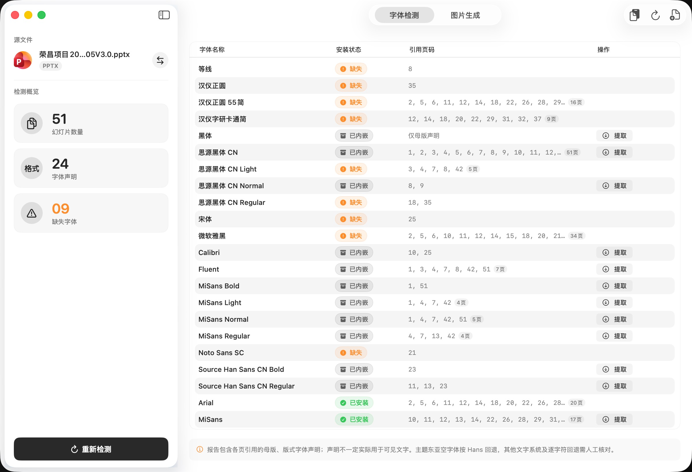

# 有用工具 · pptools

> **一款专为文稿创作者、电商运营与设计师打造的 macOS 14+ 原生文稿处理与长图制作工具。**  
> 所有文稿解析与渲染均在本地离线完成，无任何第三方依赖，原生流畅且保障文稿隐私安全。

---

## 核心功能

- 🔍 **PPTX 字体智能检测与提取**
  - 深度解析演示文稿层级，准确关联 slide → layout → master → theme 字体声明。
  - 对比系统 CoreText 字体索引，快速标出缺失字体与中英文别名，支持一键复制缺失名称。
  - 支持提取 PPTX 内嵌的 TTF / OTF / EOT 字体文件，解决跨设备排版错位隐患。

- 📜 **PDF 详情长图与画册拼接**
  - 将演示文稿导出的 PDF 一键拼接为高画质详情长图、质感卡片或双列画册。
  - 支持灵活调整输出宽度（如 750 / 1080 / 1400 / 1872 等常用规格），坐标取整防走样。
  - 支持自定义背景配色、外边距、卡片间距、圆角与阴影，智能裁去末尾空白区域。

- 🛍️ **电商主图与社媒套图生成**
  - 内置实测规范的电商主图模板（支持 1:1 独立 6 张主图套图与 6500×1000 px 宽屏通栏）。
  - 自动生成封面大图、内页网格阵列、重点倾斜叠放与服务网盘保障卡片。
  - 内置小红书卡片画板，支持多画板实时切换交互预览与一键打包批量导出。

- ⚡️ **原生体验与离线安全**
  - 纯原生 SwiftUI + CoreGraphics / CoreText 构建，完美适配 macOS 浅色与深色模式。
  - 防抖低分辨率实时交互预览，后台高效渲染与独立目录安全交付。
  - 零网络请求，文稿与设计资产均在本地内存和安全沙盒内处理。

---

## 界面预览

### 1. PPTX 字体检测与报告
一键解析 PPTX 演示文稿层级，检测幻灯片数量、母版字体声明、系统已安装/缺失字体及内嵌字体提取状态。



### 2. PDF 详情长图生成与实时预览
导入 PDF 文稿，支持无缝拼接长图、自适应边距与间距调整、背景配色与输出宽度设定，提供低分辨率防抖实时预览与高效渲染。


### 3. 电商主图与卡片套图导出
内置电商主图（1:1 套图 / 宽屏通栏）与小红书卡片画板模板，支持多张卡片实时切换查看与一键打包导出。


## 构建、测试与打包 DMG

需要 macOS 14+、Xcode Command Line Tools（Swift 5.10 或更高版本）。当前已在 Apple Silicon / Swift 6.3.3 环境编译。

### 1. 本地构建与运行

```sh
./scripts/build-app.sh
open build/有用工具.app
```

产物为本地 ad-hoc 签名的应用，尚未进行 Developer ID 签名和公证。也可用 Xcode 打开 `Package.swift` 运行 PPTTools scheme。

### 2. 一键打包 DMG 安装包

```sh
./scripts/build-dmg.sh
```

- 自动编译 Release 架构并利用 macOS 原生 `hdiutil` 生成高压缩比的 `build/有用工具-v<版本号>.dmg` 和 `build/有用工具.dmg`。
- 镜像内已预置 `/Applications` 软链接与卷标图标，并自动输出 SHA-256 校验和。

### 3. 自动检测更新与在线升级

- **启动静默检测**：应用启动 1.5 秒后在后台静默请求 GitHub Releases API，发现新版本时弹出原生更新窗口。
- **手动检查更新**：可通过顶部菜单栏「有用工具」→「检查更新…」随时检测。
- **原生在线下载**：支持查看新版本更新日志，一键在应用内后台流式下载 DMG，显示实时百分比进度条并在完成后自动打开镜像挂载升级。

### 4. 版本号与发布规范

项目遵循语义化版本规范与 macOS 纯净展示原则，详细规则参见 [docs/VERSION_SPEC.md](docs/VERSION_SPEC.md)：
- 所有界面与安装包统一显示纯版本号（如 `版本 0.1.2`），不包含 `(3)` 形式的构建括号。
- 每次修改内容发布新版，同步递增版本号并维护发布检查清单。

测试：

```sh
CLANG_MODULE_CACHE_PATH="$PWD/.build/clang-cache" \
SWIFTPM_MODULECACHE_OVERRIDE="$PWD/.build/module-cache" \
swift test --disable-sandbox
```

生成三页测试 PDF：

```sh
CLANG_MODULE_CACHE_PATH="$PWD/.build/clang-cache" swift scripts/make-demo.swift
```

## 已实现

- PPTX 导入、文件拖放；按 presentation.xml 的实际页序关联 slide → layout → master → theme，检查字体声明。
- CoreText 安装字体索引、中英文别名、缺失名称复制、重新检测、内嵌字体状态。
- 原始 TTF / OTF 与未压缩 EOT 内嵌字体提取；验证字体表边界，拒绝不支持的格式。
- PDF 全页导入，处理 cropBox 和页面旋转；72 / 144 / 300 DPI，PNG / JPEG 分页导出。
- 单列质感卡片、无缝长图、双列画册；画布宽度、边距、间距、圆角、阴影、深色背景、页码。
- 防抖低分辨率实时预览，后台渲染与导出。
- 外部 JSON 固定槽位模板、目录偏好保存、手动刷新；模板资源随 App 打包的加载通道。
- 导出至独立文件夹；先生成临时目录，全部成功后再提交，避免留下不完整的正式结果。

使用方法：PPTX 可先检测字体，再导入对应 PDF；也可直接导入 PDF → 调整模板 → 选择导出内容 → 生成并导出。长图宽度以像素设置，分页 DPI 不改变长图布局。附带 PDF 仅检查页数一致，内容是否对应需用户确认。

## 明确的首版边界

1. **详情图仅支持 PDF 输入。** 按用户要求不提供 PPT 自动转换；PPTX 仅用于字体检测。制作详情图请先在演示软件导出 PDF，再导入工具。
2. **已实测并内置 PicPark「详情页（1–35）」模板。** 从裁切形状读取 35 个槽位，保留小数坐标、背景 #2457F0、20px 圆角和无阴影样式，默认选中。详细参数及复测方法见 [模板说明](Templates/PicPark_Detail_35/README.md)。其他 PSD 不在本次范围。
3. 字体报告统计字体声明，包括被引用版式与母版中可能未使用的字体；尚未做完整 OOXML 样式级联、图表/SmartArt 字体或逐字符回退分析。东亚主题空字体按 Hans 回退，对其他文字系统应人工核对。
4. 已内嵌不代表已安装或该字体包含全部字符。压缩 EOT、异或编码字体、字体集合及未知格式不提取，也不会自动安装字体。
5. 当前 PDF 采用后台串行渲染控制内存，尚未实现需求中的 TaskGroup 分页并发。最多 500 页，分页总计 1.2 亿像素；单张图最多 8000 万像素、16000px 宽 / 60000px 高。超过预算会提示降低尺寸或拆分文稿。
6. 模板支持固定槽位、纯色背景、独立圆角/阴影、等比留白或等比填满裁切，以及按实际页数裁去末尾空行。PicPark 模板按实测参数等比填满，不拉伸图片；可勾选保留完整高度。不包含其他 PSD 的复杂背景、图层混合、旋转或目录自动监视。
7. 当前应用未启用 App Sandbox；PPTX 通过 macOS `/usr/bin/unzip` 逐条读取，不会把文稿路径解压到磁盘。后续上架需替换 ZIP 读取、加入安全作用域书签并补充签名流程。

## 模板格式

参考 `examples/two-page-gallery.json`。在工作台中选择该目录并刷新，即可加载。坐标原点位于左上角，单位为像素，槽位顺序即页序。页数超过槽位容量会报错，少于容量则保留剩余背景。模板 ID 必须唯一，所有槽位必须落在画布范围内。

## 代码结构

- `Sources/PPTTools/Views`：SwiftUI 工作台与字体报告。
- `AppModel.swift`：导入、预览、模板配置与导出状态。
- `Services/PPTXParser.swift`：ZIP/XML、关系解析、CoreText 字体索引。
- `Services/EmbeddedFontExtractor.swift`：字体格式识别和 EOT 提取。
- `Services/ImageEngine.swift`：PDF 渲染、布局、合成、图片写入。
- `Tests/PPTToolsTests`：实际构造 PPTX/PDF 的回归测试，含页序、主题关系、旋转、图像顺序、模板容量与字体提取。

## 技术方案核实

- [Apple：QLThumbnailGenerator](https://developer.apple.com/documentation/quicklookthumbnailing/qlthumbnailgenerator) 提供文档缩略图生成。
- [Apple：Quick Look Architecture](https://developer.apple.com/library/archive/documentation/UserExperience/Conceptual/Quicklook_Programming_Guide/Articles/QLArchitecture.html) 区分预览生成器与客户端公开能力；不能据此推导系统提供全页导出 API。
- [Microsoft：Font Part](https://learn.microsoft.com/en-us/openspecs/office_standards/ms-oe376/1663dabc-5d98-463f-889e-bcd9b77c3d34) 说明 Word 的 obfuscatedFont 类型，不能将其 GUID 算法直接应用于所有 PowerPoint 字体。
- [EOT 文件格式提交规范](https://www.w3.org/submissions/EOT/) 定义容器版本、FontDataSize、压缩及 XOR 标志。

后续可评估可满足保真要求的 PPTX 转换后端。性能数字需用真实文稿基准测量，不承诺需求中的 0.5 秒或无损转换。

## 本次验证记录（2026-09-06）

- 8 项 XCTest 全部通过，包括高 DPI 内容填满画布的边缘像素断言。
- Release 构建和 `codesign --verify --deep --strict` 通过。
- 实际启动打包后的 App，导入三页中文 PDF，使用 144 DPI 完成界面导出。
- 实际产物：三张 1920 × 1080 PNG、1080 × 1821 详情长图、原 PDF 副本；已查看导出长图，确认页序、中文、圆角、阴影及缩放正常。
- 未验证真实客户 PPTX、所有字体编码、所有 macOS 版本或 PicPark PSD 精准还原。

## PicPark 模板验证（2026-09-06）

已只读测量「详情页（1-35）.psd」，生成 `Templates/PicPark_Detail_35/template.json` 并内置。12 项测试通过，逐个比较 35 个槽位与 PSD 的形状/路径证据；实际从 App 导出三页样稿为 1872 × 1658 px，确认封面 + 双列、蓝色背景、圆角及比例。原 PSD 的 SHA256 未改变。完整参数详见模板目录 README。

## 模板自定义输出宽度（2026-09-06）

PicPark 模板现可在「打磨细节 → 输出宽度」输入任意 1–16000 的整数像素宽度，也可选择 750 / 1080 / 1400 / 1872 快捷值。所有几何尺寸使用统一缩放系数 `输出宽度 / 模板宽度`，保持图片、边距、间距、圆角和页码的比例，高度自动计算。像素总量和高度仍受内存预算限制。15 项测试通过；三页样稿已验证输出 1400 × 1240 PNG（`build/PicPark-1400px.png`）。

输出几何现按用户要求取整：缩放后统一四舍五入槽位边界，宽高、边距、间距和圆角均为整数像素，逐项从原坐标计算以避免长图累计偏移。16 项测试通过。

## PicPark 电商主图验证（2026-09-06）

已只读测绘 `/Users/anchor/Desktop/PicPark/主图.psd`，生成 `Templates/PicPark_Hero/template.json` 与各画板配置，切出纯净背景并随 App 打包内置（`HeroAssets` 目录）。
- 包含 6 个标准 1000 × 1000 px 独立画板（主图 1~6）及 6500 × 1000 px 宽屏通栏长图。
- 主图 1（封面大图 + 6 张内页网格底座）、主图 2~5（各 4 页重点展示与错落带投影叠放卡片）、主图 6（服务保障与网盘分享说明）。
- 支持一键勾选「导出商品主图 (1:1 套图)」，在导出目录生成独立 `商品主图/` 文件夹；工作台预览区支持各画板实时点击切换与通栏长图平滑预览。
- 20 项 XCTest 及 `scripts/verify_all.swift` 25 项测试全部通过。
